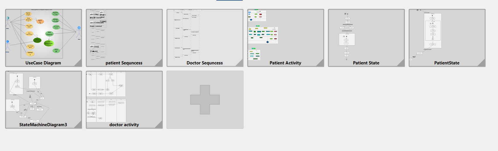

## شرح الملفات دي 
   
### ملفات Version 0 :
#### دي المشروع اللي احنا سلمناه للمعيده و فيه : `[ User case , Sequnces before Edidting ]`
  

### ملفات Version 1 :
#### دي المشروع بعد ما محمد عماد عدل السيكونسيز : `[ User case , Sequnces  ]`
 

### ملفات Version 2 `المشروع كامل`:
#### دي المشروع كامل بعد ما محمد وجيه ضاف اكتيفتي ل المريض و م مي ضافتها للدكتور و منه و ملك عملوا state للمريض : `[ User case , Sequnces before Edidting ,Activity Diagram, state Diagram for patient]`

 

##### `الملفات اللي اسمها Fluxon Project مش عارف امسحها سيبكم منها ` 
